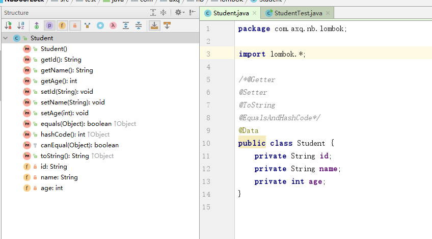

# cheatsheet


# 背景

  我们在开发过程中，通常都会定义大量的JavaBean，然后通过IDE去生成其属性的构造器、getter、setter、equals、hashcode、toString方法，当要对某个属性进行改变时，比如命名、类型等，都需要重新去生成上面提到的这些方法，那Java中有没有一种方式能够避免这种重复的劳动呢？答案是有，我们来看一下下面这张图，右面是一个简单的JavaBean，只定义了两个属性，在类上加上了@Data，从左面的结构图上可以看到，已经自动生成了上面提到的方法。 



# Lombok简介
  Lombok是一个可以通过简单的注解形式来帮助我们简化消除一些必须有但显得很臃肿的Java代码的工具，通过使用对应的注解，可以在编译源码的时候生成对应的方法。官方地址：https://projectlombok.org/，github地址：https://github.com/rzwitserloot/lombok。

# 在Maven项目的pom.xml中添加配置

```xml
<dependency>
        <groupId>org.projectlombok</groupId>
        <artifactId>lombok</artifactId>
        <version>1.16.6</version>
</dependency>
```

# 注解介绍

  下面只是介绍了几个常用的注解，更多的请参见https://projectlombok.org/features/index.html。

    @Getter / @Setter

      可以作用在类上和属性上，放在类上，会对所有的非静态(non-static)属性生成Getter/Setter方法，放在属性上，会对该属性生成Getter/Setter方法。并可以指定Getter/Setter方法的访问级别。

    @EqualsAndHashCode

      默认情况下，会使用所有非瞬态(non-transient)和非静态(non-static)字段来生成equals和hascode方法，也可以指定具体使用哪些属性。

    @ToString

      生成toString方法，默认情况下，会输出类名、所有属性，属性会按照顺序输出，以逗号分割。

    @NoArgsConstructor, @RequiredArgsConstructor and @AllArgsConstructor

      无参构造器、部分参数构造器、全参构造器，当我们需要重载多个构造器的时候，Lombok就无能为力了。

    @Data
    
      @ToString, @EqualsAndHashCode, 所有属性的@Getter, 所有non-final属性的@Setter和@RequiredArgsConstructor的组合，通常情况下，我们使用这个注解就足够了。