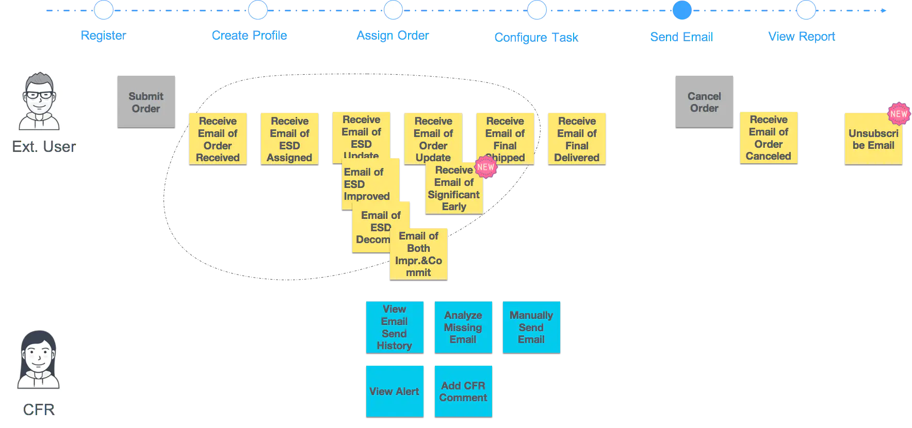
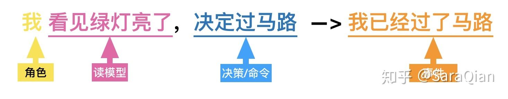
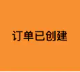
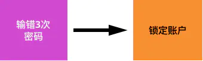
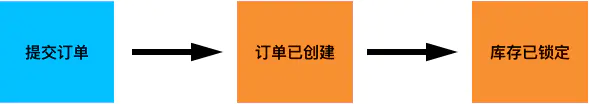
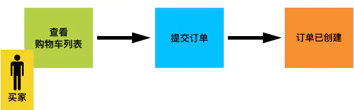
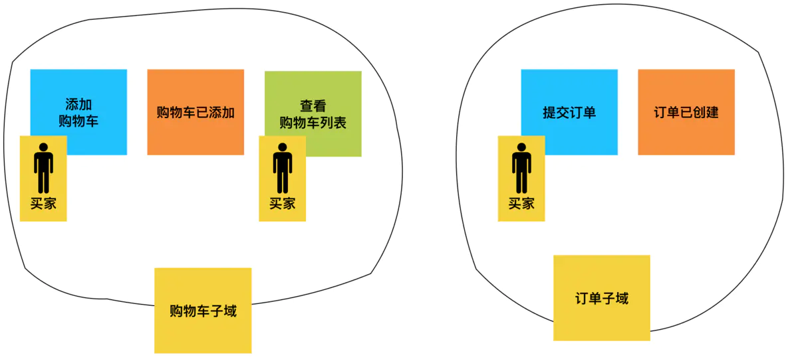
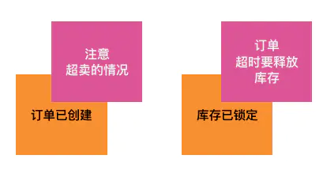
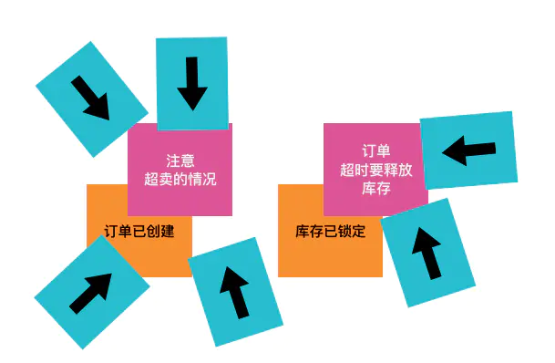
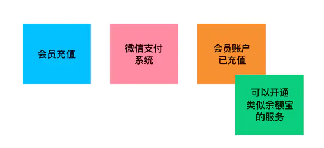

# 用户旅程

    用户旅程
    拆分为几个主要场景
    每个场景展开Event Stroming
    事件、命令、角色、外部系统

# Event Storming

从用户关心的重点事件入手分析，标注为领域事件（桔色），这些信息是需要记录和回溯的。
触发这些事件的机制：
* 业务规则，policy，这里面有很多潜规则(紫色)
* 用户命令，command，(蓝色)
* 外系统消息, extern event, (㳀粉)
* 定时器, timer， 

以事件为引导，抽象出业务对象，事件都视为对业务对象的修改，业务对象即四色建模的时标型对象。这一抽象将决定聚合根，及子域前的调用关系

切换：场景内切换，或场景间切换
* 往往做为用户命令的前置：read model(绿色)，每种读模型代表一种新的场景，一个完整子域经常有CQRS。每次新的读模型操作之后，会引出新的用户命令，也有可以是新种新的场景

划分子域的前置工作
* 用户角色分析（黄色），这是划分子域的关键，同一个人，在订单子域中是订单提交者，在支付域内是付款者，要根据角色，把两件事分开，形成两个子域。这一思路和场景思维是一致的。不同的角色划分，划分成的子域分解方案也不同。
* 这里可以参考下四色建模法，划分出Party, Place, Time, Description等类型
根据这些事件划分子域：

        子域 = 角色 + 关键领域事件 + 场景

典型结论：
* 角色，读模型，命令，事件模式

进一步检查：
* hot spot: 查找潜规则（深粉）
* opportunity: 商业价值（绿色）

以上。

[Event Storming 工作坊：探索业务全景](https://www.jianshu.com/p/d79e020cad2d)
## Domain Event，桔黄，需要记录和回溯的信息 momentual interval

    

## policy : 业务规则，潜规则 用紫色的便利贴表示

    Policy, 
    example: 用户输错3次密码之后需要锁定账户, 输错3次密码 就是我们的 Policy，锁定账户则是 Policy 触发的新领域事件

## command

    探索用户如何与我们的系统进行交互，命令代表着用户与系统的交互，而事件则是发生交互之后所产生的。
    用蓝色的卡片表示命令。与 CQRS（Command Query Responsibility Segregation）的Command 含义相同。

## 读模型, 浅绿色

## role, 黄色

    角色是系统中必不可少的，我们可以轻易的识别出这一系列卡片由哪个角色触发

    【买家】在【查看购物车列表】后【提交订单】完成【订单已创建】，与我们写的用户故事越来越接近

## extern system, 浅粉色

    在开发系统时多多少少都会与外部系统做集成，例如：支付系统、短信系统等等。我们通过浅粉色的卡片将外部系统表示出来。

## sub domain

## hot spot, 警告信息，深粉

## bottleneck, 蓝色便利贴

## opportunity, 新的商机或者价值，绿色的便利贴

输入

用户命令
业务策略：逻辑规则，定时规则，两者结合
外系统消息

