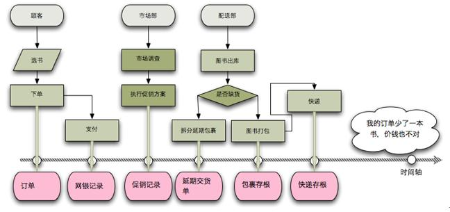
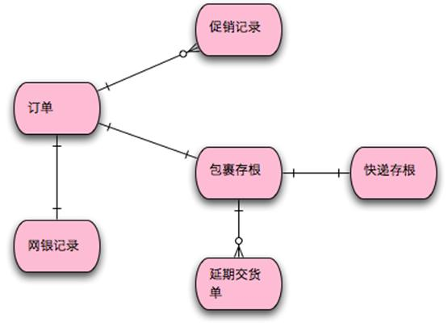
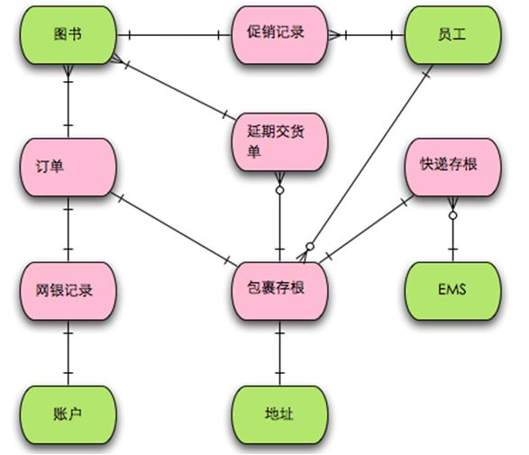
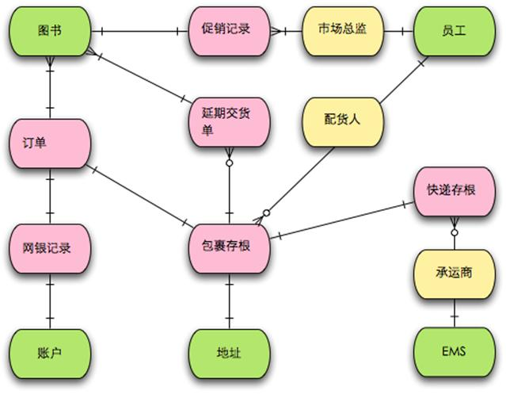
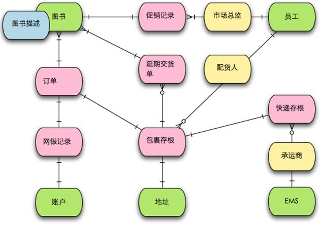

# 四色建模法

## 四色建模法包括

* 时标型（Moment-Interval）对象：具有可追溯性的记录运营或管理数据的时刻或时段对象，用粉红色表示
* PPT（Party/Place/Thing）对象：代表参与到流程中的参与方/地点/物，用绿色表示
* 角色（Role）对象：在时标型对象与 PPT 对象（通常是参与方）之间参与的角色，用黄色表示
* 描述（Description）对象：对 PPT 对象的一种补充描述，用蓝色表示

## 从可追溯的角度分析建模

[reference](https://www.infoq.cn/article/xh-four-color-modeling/)

* 任何的业务事件都会以某种数据的形式留下足迹

    这两个订单实际上这个你这个企业法律责任的起点和终点这两个订单实际上这个你这个企业法律责任的起点和终点

    数据是支撑你运营体系的关键流程的执行结果

    关键执行步骤要留下数据，备查

        如果我付出一笔资金，那么我的权益是什么？
        
        如果我收到一笔资金，那么我的义务是什么？

    作为业务分析师的你，则应该知道那些事件在运营上是需要追溯的，这些事件都留下了什么足迹。这些足迹有一个共同的特性，在一段时间内有效（moment-interval）

[一个书店追查订单缺物品的的例子](https://www.infoq.cn/article/xh-four-color-modeling/)，提出建模的步骤：

1. 首先以满足管理和运营的需要为前提，寻找需要追溯的事件，别出相应的时标性对象。
    
2. 根据这些需要追溯，寻找足迹以及相应的时标性对象。建立关系，产生核心骨干模型。
    
1. 寻找时标对象周围的人／事／物
    
1. 从中抽象角色
    
1. 把一些信息用描述对象补足。
    

#### 为什么你会以一个看上去像极端情况的例子来说明这个建模方法？

    以我的经验来看，对于业务系统有两个东西是很重要的：可追溯性（traceability）和执行效率（efficiency）。这里的可追溯性是指责任的可追溯性（traceability of liability），而通常都是在一些不太好的事情发生之后，才需要对责任进行追溯。所以想一个相对负面的例子更容易帮助我们找到建模所需要解决的问题。
