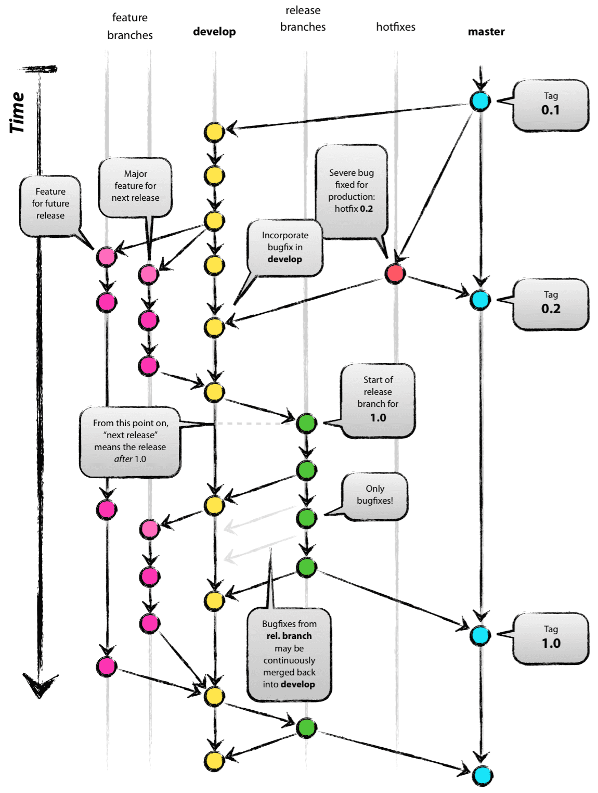

# 分支的意义

## 分支
master:　生产环境，保持可用

release: master的候补分支
hotfix:  master的救急分支
support: master的老旧分支

develop: 开发分支，集成新功能
feature/s: develop的活动分支



## 分支与环境的对应关系

* master => 生产环境
* release/*，hotfix/* => 预上线环境
* feature/*，develop => 开发环境

# 开发活动(git flow init)

new project
```bash
$ git flow init

No branches exist yet. Base branches must be created now.
Branch name for production releases: [master]
Branch name for "next release" development: [develop]

How to name your supporting branch prefixes?
Feature branches? [feature/]
Release branches? [release/]
Hotfix branches? [hotfix/]
Support branches? [support/]
Version tag prefix? []
```

## 功能开发(git flow feature start|finish demo)

* 从 develop 创建一个新分支（feature/*）
* 功能开发
* 生产环境测试
* Review
* Merge 回 develop 分支

start 
```bash
(develop) $ git flow feature start demo

Switched to a new branch 'feature/demo'

Summary of actions:
- A new branch 'feature/demo' was created, based on 'develop'
- You are now on branch 'feature/demo'
```

```bash
(feature/demo) $ git flow feature finish demo

Switched to branch 'develop'
Already up-to-date.
Deleted branch feature/demo (was 48fbada).

Summary of actions:
- The feature branch 'feature/demo' was merged into 'develop'
- Feature branch 'feature/demo' has been removed
- You are now on branch 'develop'
```

## 代码发布(git flow release start|finish demo)

需要发布新功能到生产环境时

* 从 develop 创建新分支（release/*）
* 发布 feature 分支代码到预上线环境
* 测试并修复问题
* Review
* 分别 merge 回 develop 和 master 分支
* 发布 master 代码到生产环境

发布代码前
```bash
(develop) $ git flow release start demo

Switched to a new branch 'release/demo'

Summary of actions:
- A new branch 'release/demo' was created, based on 'develop'
- You are now on branch 'release/demo'
```

测试完成准备上线时

```bash
(release/demo) $ git flow release finish demo

Switched to branch 'master'
Deleted branch release/demo (was 48fbada).

Summary of actions:
- Latest objects have been fetched from 'origin'
- Release branch has been merged into 'master'
- The release was tagged 'demo'
- Release branch has been back-merged into 'develop'
- Release branch 'release/demo' has been deleted
```

## 问题修复(git flow hotfix start|finish demo-hotfix)

当生产环境代码出现问题需要立刻修复时

* 从 master 创建新分支（hotfix/*）
* 发布 hotfix 代码到预上线环境
* 修复问题并测试
* Review
* 分别 merge 会 develop 和 master 分支
* 发布 master 代码到生产环境

发现线上故障时，
```bash
(master) $ git flow hotfix start demo-hotfix

Switched to a new branch 'hotfix/demo-hotfix'

Summary of actions:
- A new branch 'hotfix/demo-hotfix' was created, based on 'master'
- You are now on branch 'hotfix/demo-hotfix'
```

修复问题后
```bash
(hotfix/demo-hotfix) $ git flow hotfix finish demo-hotfix

Deleted branch hotfix/demo-hotfix (was 48fbada).

Summary of actions:
- Latest objects have been fetched from 'origin'
- Hotfix branch has been merged into 'master'
- The hotfix was tagged 'demo-hotfix'
- Hotfix branch has been back-merged into 'develop'
- Hotfix branch 'hotfix/demo-hotfix' has been deleted
```

# 环节

功能开发
生产环境测试
开发环境测试
预生产环境测试
Review
修复问题

# gitflow工具支持
```bash
git flow init 
git flow feature start|finish demo
git flow hotfix start|finish demo
git flow release start|finish demo

